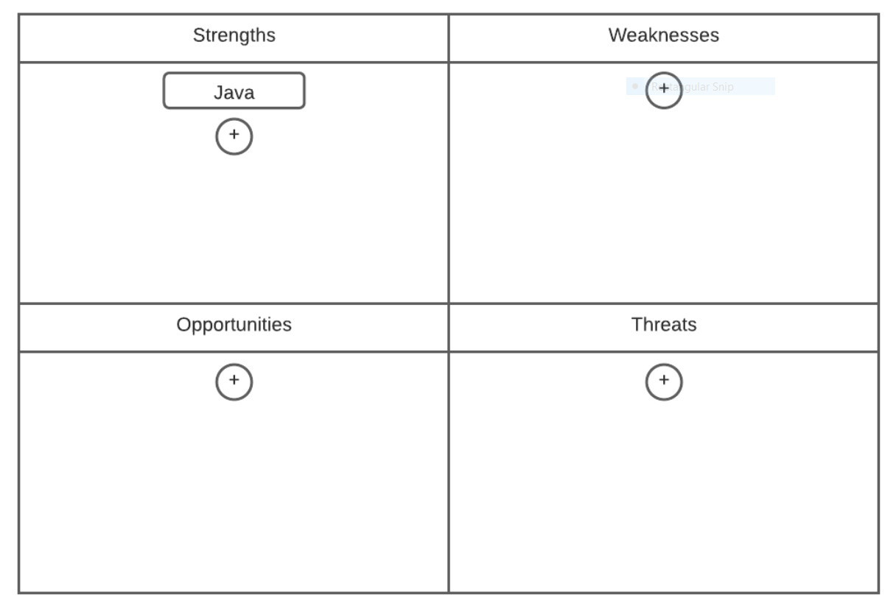
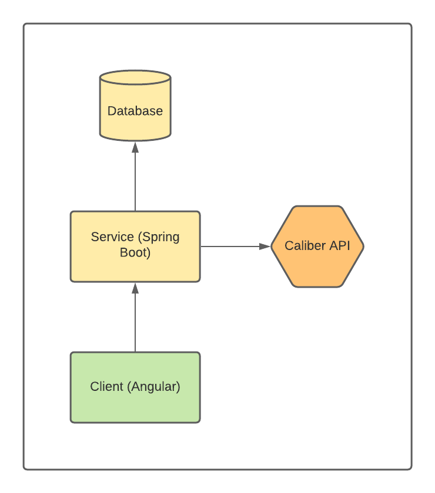
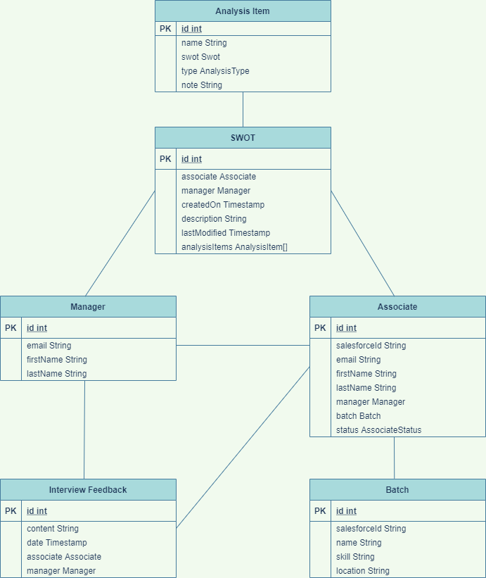

# Spring Boot Microservice for Caliber Staging Module
Due to the remote nature work amidst the COVID pandemic, Revature Staging Managers are no longer delegated to managing associates in specific geographical region, as these associates span the entirety of the US. The Caliber Staging Module is an application that manages the assignment of associates to particular Staging Mangers, in order to balance workload and also provide information on those particular associates in the form of a SWOT analysis.  The app's SWOT cabability provides a centralized resource for Staging managers across Revature's national locations to manage and review associates as they prepare for client interviews.

### Sprint 1 Team Members:
- Ben Johnston - Scrum Master, Team Lead, Staging Listener
- Jeremy Critchley - Team Lead, Created Associate Controller, Controller and Service Testing, Modal Popup
- Quincy Roman - Team Lead, Devops, SWOT analyses functionalities
- Connor Ryan - Team Lead, Devops, Docker/Jenkins configurations
- Azhya Knox - Team Lead, BatchRetriever, BatchWriter, Firebase Authentication, User UI/UX
- Andrew Curry - Testing & Assigning Associates to Managers
- Mareo Yapp - Viewing all associates assigned to a Manager, Testing and Documentation
- Saleel Bey - Documentation, Styling, Retrieving Managers and associates
- Thomas Morgan - create, view, and modify SWOTs
- Isa Reinert - Create, view, and modify SWOTs
- Patrick Warring - Create, view, and modify SWOTs
- Grayson McClellan - Create, view, and modify SWOTS and CSS development
- Suva Shahria - View recently graduated associates, Testing, Modal Popup
- Young Ha Shin - view component and testing view component
- Saleel Bey - Documentation, Styling, Retrieving Managers and associates
- Max Goncharov - Retrieving managers, dividing associates, styling, and documentation
- Alejandro Garza - Paired Programming, troubleshooting.

#### Sprint 1 User Stories
- A manager can view all associates assigned to him.
- A manager can view all associates that are new to staging.
- The system will automatically assign associates to a staging manager.
- A manager can create a SWOT analysis for an associate in order to decide actions the associate should prioritize.
- A manager can view previous SWOT.
- A manager can add items to a SWOT.

### Sprint 2 Team Members
- Darien Sosa - Project Leader, Scrum Master - Removed animations, feedback, debugging
- Jay Monari - Project Leader - Firebase, technical troubleshooter
- Olga Melnikova - Project Leader - Add feedback, front end testing
- Chris Davis - Team Leader - Toast messaging, end to end testing
- John Jacobelli - Team Leader - Updating associate, front end testing
- Ryan Curley - Team Leader - View and delete SWOT, end to end testing
- Samuel Curtis - Team Leader - Delete SWOT items, update feedback
- Abdulaziz Al Biimani - Team Member - Front end testing
- Adam Alouani - Team Member - SWOT view page rewrite, add SWOT items
- Adam Schroth - Team Member - Updating associate, debugging
- Alexander Nelson - Team Member - Back end testing
- Carlos Guerrero - Team Member - View SWOT page, documentation
- Chirenjeebi Parajuli - Team Member - End to end testing
- Daniel Butcher - Team Member - Added note field, input validation, testing, documentation
- Ian Real - Team Member - Update SWOT, front end testing
- James Barlowe - Team Member - Input validation, page styling
- John Matthew Lao - Team Member - Added SWOT name field, input validation, front end testing
- Jugen Fornoles - Team Member - Back end testing
- Matthew Sheldon - Team Member - Back end testing, documentation
- Maxwell Dimgba - Team Member - Toast messaging, end to end testing
- Misael Mendoza - Team Member - Delete feedback, testing
- Patrick Wilson - Team Member - Added SWOT name field, associate filtering, back end testing
- Ryan Eckman - Team Member - Delete SWOT, documentation
- Shamir Cetoute - Team Member - Standardized CSS, documentation
- Stephen Zappitello - Team Member - Added note field, debugging

#### Sprint 2 User Stories
- As a User, I should be able to use TAB and ENTER alongside typing to create or update a SWOT analysis with a smooth UX.
- Integrate Backend With Firebase for Authorization and Authentication.
- As a User, I find that the animations slow down the application and distract from the functionality so they should be removed.
- As a User, I want to be able to manually change the batch of an associate.
- As a User, while creating a SWOT, I should be able to give the SWOT a name to identify it when selecting which SWOT to view.
- As a Staging Manager, I should be able to attach interview feedback to associates after their interviews.
- As a User, I should be able to edit the name given to a SWOT analysis so that it's name remains relevant to the content and purpose of the analysis.
- As a User, I should not be able to visit the "view SWOT" component if an associate does not have one created.  Instead the application should present the user with a "create SWOT" form, and then redirect to the SWOT page once the form has been successfully submitted.
- As a User, I should be able to delete a SWOT item but it should be safe and ask me for confirmation.
- As a User, I should not be able to submit a form if it is not entirely filled out.
- As a Staging Manager, I am able to update the status of an Associate so that I can maintain an accurate record of Staging members.
- As a Staging Manager, I should be able to sort and/or filter the list of associates I am managing.
- Implement testing for previous sprint components.
- As a User, while creating, editing, or viewing a SWOT Analysis I should see the analysis in a format similiar to the attached wireframe.

- As a User, if I receive notifications from the UI, they should be non-blocking.  ie I should be able to continue to interact with the webpage if I wish not to address the alter.
- Fix the the create SWOT functionality so that refresh does not cause the session information to be lost.
- Create :root css variables to allow standardization of a color scheme across the application.
- As a User, I should be able to add a note to SWOT items.

**Architecture Diagram**

**ERD Diagram**

Associate status' are enum staging, released, and project. Analysis type are enum strengths, weaknesses, opportunities and threats.

### Technologies Used
- Frontend:
  - Angular11
  - AngularFire/Firebase
  - Jasmine
  - Karma
  - Bootstrap
  - HTML5
  - CSS3
  - Caliber API
- Backend:
  - Spring Boot
  - Spring Data
  - Java8
  - Maven
  - JUnit
  - Mockito
  - PostgreSQL
  - Log4j
- Devops:
  - Jenkins
  - AWS EC2
  - AWS RDS
  - Docker
- Other
  - Git
  - Agile methodologies

Frontend repository: https://github.com/JacobHayhurst-Batch-878/caliber-staging-module-front/tree/staging
